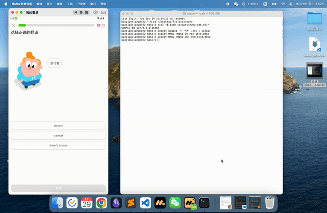

# mano

A thin **VLM-driven Android GUI automation engine** with a small, whitelisted
ADB surface and a growing library of per-app **packs**.

mano looks at the screen with a hosted GUI vision-language model (VLM), proposes
**one safe action at a time**, and executes it through a deliberately tiny ADB
action surface (tap / swipe / text / a few keyevents). App-specific knowledge —
prompts, guards, and deterministic solvers — lives in `packs/`, never in the
engine.

> Status: early spike (v0.1). The engine is generic; the first pack drives one
> Duolingo basic lesson end-to-end on an Android emulator.

## Demo



▶️ **[Watch the full screen recording (MP4)](REPLACE_ME_WITH_UPLOADED_MP4_URL)**
<!-- Upload mano-demo.mp4 via a GitHub issue/comment (drag-and-drop), copy the
     generated https://github.com/user-attachments/assets/... link, and replace
     the URL above. Do NOT commit the .mp4 into the repo. -->

## Why "engine + packs" instead of a zero-shot agent

A GUI VLM can already look at almost any unseen screen and propose a plausible
tap (**perception generalizes**). Reliably *completing* a multi-step task in an
unseen app does **not** generalize yet — it needs a thin per-app layer. mano
makes that boundary explicit:

- **Engine (`mano/`)** — app-agnostic, reusable: the VLM client, the ADB
  executor, tool-call parsing/coordinate mapping, screenshot helpers, and
  UI-XML parsing.
- **Packs (`packs/<app>/`)** — app-specific: the system prompt/instructions,
  safety guards (paywall, off-task, task boundary), and deterministic solvers
  for mechanical multi-tap subtasks the VLM handles poorly.

This is the same shape as a plugin ecosystem: the engine is out-of-the-box; an
app is "out-of-the-box" once it has a pack.

## Capability routing

Each screen is routed by what it needs:

- **Semantic judgment** (read a question, pick an answer, detect a paywall or a
  completion screen) → the VLM.
- **Mechanical multi-tap** with visible structure (matching pairs, ordering
  chips) → a **deterministic solver** that reads the uiautomator XML, decides
  taps in code, and re-dumps to converge — eliminating the VLM's cross-frame
  spatial-state drift.

The Duolingo pack ships a `matching_solver` as the first example.

## Requirements

- Python **3.10+** (runtime uses the standard library only — no third-party deps)
- `adb` (Android platform-tools) on `PATH`, or set `MANO_ADB_PATH`
- An Android emulator/device with the target app installed and logged in
  (developed against **MuMu Player**, serial `127.0.0.1:16384`)
- An API key for a GUI VLM (default: DashScope / 阿里百炼 `gui-plus`)

## Quickstart

```bash
git clone <your-fork-url> mano && cd mano
cp .env.example .env            # then fill MANO_API_KEY

# load env (or export manually)
export $(grep -v '^#' .env | xargs)

# 1) sanity-check the VLM on a single screenshot (parse only, no taps)
python3 packs/duolingo/run.py smoke --image /path/to/screenshot.png

# 2) ground-truth the matching-solver XML parse on the current screen
python3 packs/duolingo/run.py dump

# 3) drive one lesson (start the app at a lesson first; watch the screen)
python3 packs/duolingo/run.py run
```

Every run writes evidence to `packs/duolingo/runs/duo-<ts>/`
(`steps.jsonl`, per-step screenshots + XML, `summary.json`). **These contain
account screenshots and are git-ignored — do not publish them.**

## Safety

mano is built around a reliability cage, not blind autonomy:

- **Whitelisted ADB surface** — only tap/swipe/short text/a few keyevents;
  unknown or high-risk actions are refused.
- **Guards run before every action** — leaves-the-app, paywall, and per-task
  boundary detection stop the loop instead of wandering.
- **No purchases** — the model is instructed never to buy/subscribe/start a
  trial, and paywall markers hand control back to the human.
- **Human in the loop** — a person watches the screen during a run.

Use mano only on your own accounts and in compliance with each app's terms of
service. It is a research/automation tool, not a bot farm.

## Layout

```
mano/                 # generic engine (stdlib only)
  errors.py           # ManoError, ManoNetworkError
  media.py            # PNG size + image data-url encoding
  action_codec.py     # parse <tool_call>, map 1000x1000 coords -> pixels
  adb_executor.py     # whitelisted Adb + execute_action
  gui_plus_client.py  # OpenAI-compatible GUI-VLM client (GuiVLM)
  ui_xml.py           # uiautomator XML parsing helpers
packs/
  duolingo/           # first app pack
    prompts.py        # system prompt + per-step instruction
    guards.py         # paywall / lesson-done markers / foreground pkg
    matching_solver.py# deterministic "选择配对" solver
    run.py            # driver loop + smoke/dump subcommands
```

## Adding a new app

See [docs/adding-a-pack.md](docs/adding-a-pack.md).

## License

[MIT](LICENSE).
